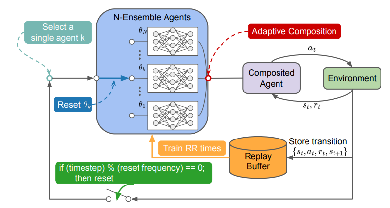

# Sample-Efficient and Safe Deep Reinforcement Learning via Reset Deep Ensemble Agents

This readme file is an outcome of the [CENG501 (Spring 2024)](https://ceng.metu.edu.tr/~skalkan/DL/) project for reproducing a paper without an implementation. <br/>
See [CENG501 (Spring 2024) Project List](https://github.com/CENG501-Projects/CENG501-Fall2024) for a complete list of all paper reproduction projects.

# 1. Introduction

The paper subject to our implementation, published at NeurIPS 2023, introduces Reset Deep Ensemble Agents (RDE) [[1]], a framework that combines ensemble learning with periodic parameter resets to simultaneously mitigate primacy bias, and the performance collapse issues associated with parameter resetting. 
This repository aims to reproduce the key findings of the paper, focusing on its proposed method's performance improvements in sample efficiency, safety, and stability.

## 1.1. Paper summary

Deep reinforcement learning (RL) combines neural networks and reinforcement learning to solve complex tasks. However, a key challenge in deep RL is *primacy bias*, a phenomenon where deep neural networks (DNNs) overfit to early experiences, which tend to be replayed more than newer experiences, due to design of replay buffers built into them. This bias impairs the learning process, particularly at higher replay ratios, leading to suboptimal performance and a decline in sample efficiency. Additionally, methods that mitigate primacy bias, such as *parameter resets*, can cause performance collapses immediately following resets, undermining their applicability in safe RL environments.

### Key Contributions
The paper introduces a novel approach to deep RL that:
1. Employs *sequential resets* to reduce the negative effects of primacy bias, and counter overfitting.
2. Introduces *ensemble learning* for deep RL applications which effectively combines *N* agents into a single agent, and benefits from the diversity among agents to keep the performance steadily high against sequential resets on agents within the ensemble.
3. Utilizes *adaptive action weighting* to select actions based on Q-values, ensuring robust performance and a balance between exploration and exploitation.
4. Improves *sample efficiency* compared to baseline methods across continuous and discrete environments such as Atari-100k [[2]], MiniGrid [[3]], and DeepMind Control Suite [[4]].
5. Tailors itself for *safety-critical* RL tasks through modifications in action selection, significantly reducing safety constraint violations.

# 2. The method and our interpretation

## 2.1. The original method

The RDE framework proposes a novel methodology to tackle primacy bias and performance collapses in deep reinforcement learning. Overall diagram of the RDE is shown in the Figure 1, [[1]]. First, $N$ ensemble agents with unique sets of initialized parameters are created. Ensemble agents are adaptively composited into a single agent that interacts with the environment during the training phase. At every $T_{reset}$ time-step, a single agent $k$ is selected and all of its parameters $θ_k$ are reset by a resetting mechanism.

<p align="center">
  <br>
  <em>Figure 1: Overall diagram of RDE</em>
</p>

### 1. **Ensemble Agents**
   - The system is built on an ensemble of $N$ agents, all with identical neural network architectures but initialized with distinct random parameters. This initialization promotes diversity in agent behavior and learning.
   - Each agent is independently trained using the same replay buffer, which stores past interactions with the environment. The shared replay buffer ensures sample efficiency and avoids redundancy.
   - During training, the ensemble agents are adaptively integrated into a single composite agent that interacts with the environment. This integration is key to leveraging the diversity of the ensemble while maintaining operational efficiency.

### 2. **Sequential Resets**
   - The framework introduces a staggered reset mechanism, where each agent in the ensemble undergoes a reset at fixed intervals $T_{reset}$. Resets are performed in a sequential, round-robin fashion, ensuring that at most one agent is reset at any given time.
   - During a reset, the parameters of the selected agent are reinitialized to their random initial values, while the parameters of the remaining $N-1$ agents are retained.
   - By preserving the trained parameters of most agents, the system avoids the catastrophic performance collapses associated with simultaneous resets in traditional methods. This allows the composite agent to continue interacting with the environment effectively, even during resets.

### 3. **Adaptive Action Selection**
   - To ensure robust decision-making, the composite agent selects actions adaptively based on the Q-values of each ensemble agent.
   - For a given state $s$, each agent $k$ generates an action $a_k$ along with its associated Q-value, $Q(s, a_k)$. The probability of selecting an action is determined by a softmax function:
```math
$$p_{s} = softmax(Q(s, a_1)/\alpha, Q(s, a_2)/\alpha, ..., Q(s, a_N)/\alpha)$$
```
Here, $\alpha$ is a temperature parameter that scales the Q-values to control the influence of differences among them. A higher Q-value corresponds to a higher selection probability.
   - Actions generated by recently reset agents are assigned lower probabilities because their Q-values are less reliable immediately after a reset. This adaptive weighting allows the composite agent to prioritize actions from more stable, trained agents, effectively mitigating performance instability.

### Safety-Critical Modifications
   - In safety-critical reinforcement learning tasks, such as those with constraints on unsafe states or actions, the adaptive action selection mechanism is modified to incorporate safety considerations.
   - The final selection probability is computed as:
```math
p^{safe}_{s} = \kappa * p_{s} + (1 - \kappa) * p^{c}_{s}
```
 where:
 -  $p_s$  is the action selection probability based on Q-values.
 -  $p^{c}_{s}$ prioritizes actions with lower safety costs.
 -  $\kappa$ is a mixing coefficient that balances the importance of reward maximization (through Q-values) and safety cost minimization.
 - This adjustment ensures that the composite agent not only performs efficiently but also adheres to safety constraints, reducing violations in real-world scenarios.

## 2.2. Our interpretation

@TODO: Explain the parts that were not clearly explained in the original paper and how you interpreted them.

# 3. Experiments and results

## 3.1. Experimental setup

@TODO: Describe the setup of the original paper and whether you changed any settings.

## 3.2. Running the code

@TODO: Explain your code & directory structure and how other people can run it.

## 3.3. Results

@TODO: Present your results and compare them to the original paper. Please number your figures & tables as if this is a paper.

# 4. Conclusion

@TODO: Discuss the paper in relation to the results in the paper and your results.

# 5. References

[1]: <https://arxiv.org/abs/2310.20287> "W. Kim, Y. Shin, J. Park, and Y. Sung, 'Sample-Efficient and Safe Deep Reinforcement Learning via Reset Deep Ensemble Agents,' arXiv.org, 2023. https://arxiv.org/abs/2310.20287 (accessed Nov. 23, 2024)."
[2]: <https://arxiv.org/abs/1207.4708> "M. G. Bellemare, Y. Naddaf, J. Veness, and M. Bowling, 'The Arcade Learning Environment: An Evaluation Platform for General Agents,' Journal of Artificial Intelligence Research, vol. 47, pp. 253-279, Jun. 2013, doi: https://doi.org/10.1613/jair.3912."
[3]: <https://arxiv.org/abs/2306.13831> "M. Chevalier-Boisvert et al., 'Minigrid & Miniworld: Modular & Customizable Reinforcement Learning Environments for Goal-Oriented Tasks,' arXiv.org, 2023. https://arxiv.org/abs/2306.13831 (accessed Nov. 23, 2024)."
[4]: <https://www.softwareimpacts.com/article/S2665-9638(20)30009-9/fulltext> "S. Tunyasuvunakool et al., 'dm_control: Software and tasks for continuous control,' Software Impacts, vol. 6, p. 100022, Nov. 2020, doi: https://doi.org/10.1016/j.simpa.2020.100022."


`[1]`: "W. Kim, Y. Shin, J. Park, and Y. Sung, 'Sample-Efficient and Safe Deep Reinforcement Learning via Reset Deep Ensemble Agents,' arXiv.org, 2023. https://arxiv.org/abs/2310.20287 (accessed Nov. 23, 2024)." <br/>
`[2]`: "M. G. Bellemare, Y. Naddaf, J. Veness, and M. Bowling, 'The Arcade Learning Environment: An Evaluation Platform for General Agents,' Journal of Artificial Intelligence Research, vol. 47, pp. 253-279, Jun. 2013, doi: https://doi.org/10.1613/jair.3912." <br/>
`[3]`: "M. Chevalier-Boisvert et al., 'Minigrid & Miniworld: Modular & Customizable Reinforcement Learning Environments for Goal-Oriented Tasks,' arXiv.org, 2023. https://arxiv.org/abs/2306.13831 (accessed Nov. 23, 2024)." <br/>
`[4]`: "S. Tunyasuvunakool et al., 'dm_control: Software and tasks for continuous control,' Software Impacts, vol. 6, p. 100022, Nov. 2020, doi: https://doi.org/10.1016/j.simpa.2020.100022." <br/>

# Contact

[Ege Uğur Aguş](mailto:email@domain.com) <br/>
[Atakan Botasun](mailto:abotasun@metu.edu.tr)
