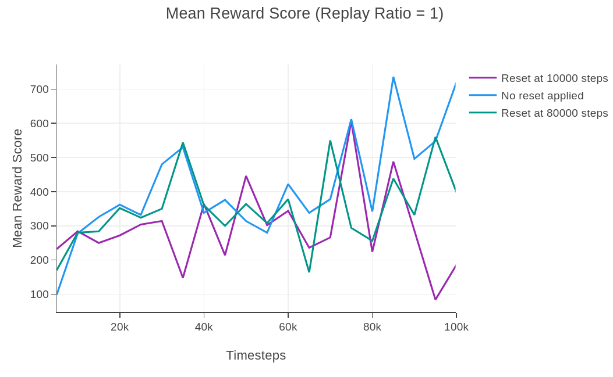
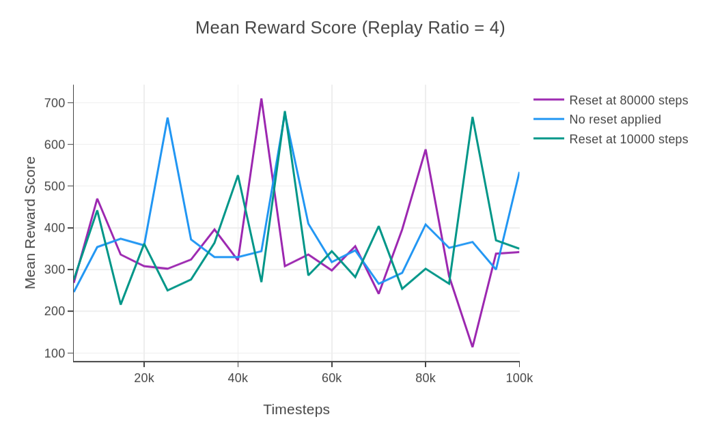

# Sample-Efficient and Safe Deep Reinforcement Learning via Reset Deep Ensemble Agents

This readme file is an outcome of the [CENG501 (Spring 2024)](https://ceng.metu.edu.tr/~skalkan/DL/) project for reproducing a paper without an implementation. <br/>
See [CENG501 (Spring 2024) Project List](https://github.com/CENG501-Projects/CENG501-Fall2024) for a complete list of all paper reproduction projects.

# 1. Introduction

The paper subject to our implementation, published at NeurIPS 2023, introduces Reset Deep Ensemble Agents (RDE) [[1]], a framework that combines ensemble learning with periodic parameter resets to simultaneously mitigate primacy bias, and the performance collapse issues associated with parameter resetting. 
This repository aims to reproduce the key findings of the paper, focusing on its proposed method's performance improvements in sample efficiency, safety, and stability.

## 1.1. Paper summary

Deep reinforcement learning (RL) combines neural networks and reinforcement learning to solve complex tasks. However, a key challenge in deep RL is *primacy bias*, a phenomenon where deep neural networks (DNNs) overfit to early experiences, which tend to be replayed more than newer experiences, due to design of replay buffers built into them. This bias impairs the learning process, particularly at higher replay ratios, leading to suboptimal performance and a decline in sample efficiency. Additionally, methods that mitigate primacy bias, such as *parameter resets*, can cause performance collapses immediately following resets, undermining their applicability in safe RL environments.

### Key Contributions
The paper introduces a novel approach to deep RL that:
1. Employs *sequential resets* to reduce the negative effects of primacy bias, and counter overfitting.
2. Introduces *ensemble learning* for deep RL applications which effectively combines *N* agents into a single agent, and benefits from the diversity among agents to keep the performance steadily high against sequential resets on agents within the ensemble.
3. Utilizes *adaptive action weighting* to select actions based on Q-values, ensuring robust performance and a balance between exploration and exploitation.
4. Improves *sample efficiency* compared to baseline methods across continuous and discrete environments such as Atari-100k [[2]], MiniGrid [[3]], and DeepMind Control Suite [[4]].
5. Tailors itself for *safety-critical* RL tasks through modifications in action selection, significantly reducing safety constraint violations.

# 2. The method and our interpretation

## 2.1. The original method

The RDE framework proposes a novel methodology to tackle primacy bias and performance collapses in deep reinforcement learning. Overall diagram of the RDE is shown in the Figure 1, [[1]]. First, $N$ ensemble agents with unique sets of initialized parameters are created. Ensemble agents are adaptively composited into a single agent that interacts with the environment during the training phase. At every $T_{reset}$ time-step, a single agent $k$ is selected and all of its parameters $θ_k$ are reset by a resetting mechanism.

<p align="center">
  <br>
  <em>Figure 1: Overall diagram of RDE</em>
</p>

### 1. **Ensemble Agents**
   - The system is built on an ensemble of $N$ agents, all with identical neural network architectures but initialized with distinct random parameters. This initialization promotes diversity in agent behavior and learning.
   - Each agent is independently trained using the same replay buffer, which stores past interactions with the environment. The shared replay buffer ensures sample efficiency and avoids redundancy.
   - During training, the ensemble agents are adaptively integrated into a single composite agent that interacts with the environment. This integration is key to leveraging the diversity of the ensemble while maintaining operational efficiency.

### 2. **Sequential Resets**
   - The framework introduces a staggered reset mechanism, where each agent in the ensemble undergoes a reset at fixed intervals $T_{reset}$. Resets are performed in a sequential, round-robin fashion, ensuring that at most one agent is reset at any given time.
   - During a reset, the parameters of the selected agent are reinitialized to their random initial values, while the parameters of the remaining $N-1$ agents are retained.
   - By preserving the trained parameters of most agents, the system avoids the catastrophic performance collapses associated with simultaneous resets in traditional methods. This allows the composite agent to continue interacting with the environment effectively, even during resets.

### 3. **Adaptive Action Selection**
   - To ensure robust decision-making, the composite agent selects actions adaptively based on the Q-values of each ensemble agent.
   - For a given state $s$, each agent $k$ generates an action $a_k$ along with its associated Q-value, $Q(s, a_k)$. The probability of selecting an action is determined by a softmax function:
```math
p_{s} = softmax(Q(s, a_1)/\alpha, Q(s, a_2)/\alpha, ..., Q(s, a_N)/\alpha)
```
Here, $\alpha$ is a temperature parameter that scales the Q-values to control the influence of differences among them. A higher Q-value corresponds to a higher selection probability.
   - Actions generated by recently reset agents are assigned lower probabilities because their Q-values are less reliable immediately after a reset. This adaptive weighting allows the composite agent to prioritize actions from more stable, trained agents, effectively mitigating performance instability.

### Safety-Critical Modifications
   - In safety-critical reinforcement learning tasks, such as those with constraints on unsafe states or actions, the adaptive action selection mechanism is modified to incorporate safety considerations.
   - The final selection probability is computed as:
```math
p^{safe}_{s} = \kappa * p_{s} + (1 - \kappa) * p^{c}_{s}
```
 where:
 -  $p_s$  is the action selection probability based on Q-values.
 -  $p^{c}_{s}$ prioritizes actions with lower safety costs.
 -  $\kappa$ is a mixing coefficient that balances the importance of reward maximization (through Q-values) and safety cost minimization.
 - This adjustment ensures that the composite agent not only performs efficiently but also adheres to safety constraints, reducing violations in real-world scenarios.

## 2.2. Our interpretation

The original paper uses Stable-Baselines3 [[5]] as its primary framework, and its main mechanisms are clearly explained. However, to the best of our knowledge, Stable-Baselines3 does not support a multi-agent structure or a reset mechanism. Below, we outline our approach to implementing these features.

### 1. **Sequential Reset Mechanism**

The **Sequential Reset Mechanism** is a core innovation in the RDE framework that effectively mitigates primacy bias and prevents performance collapses caused by weight reseting. This approach ensures that the agents can benefit from high replay ratios without suffering from overfitting to early experiences. Below are the key details of the implementation:

1. **Configurable Reset Depth**
    - **full**: Reinitializes all layers of the neural network. 
    - **last1**: Only reinitializes the last layer of the network. 
    - **last2**: Only reinitializes the last two layers of the network. 
    - The depth of reset can be configured based on the environment and the complexity of the task. In the original paper they selected different reset depths for various environments and tasks.

2. **Replay Buffer Preservation**
    - The replay buffer is preserved across resets, allowing agents to learn from previously collected experiences without requiring new interactions with environment.

3. **Sequential Reset**
    - At predefined intervals a single agent (the next one in the sequence) in the ensemble is selected for reset (parameter reinitialization), while others remain stable. The resetted agent is added to the end of the reset sequence.

#### Implementation

1. Sequential selection
```python
    if (self.global_step>0) and (self.global_step % RESET_FREQUENCY == 0):
        self.writer.add_scalar("ResetAgentIdx", self.last_reset_idx, episode_count)
        print(f"[INFO] Sequential reset: agent {self.last_reset_idx} at step={self.global_step}")
        self.reset_agent(self.last_reset_idx)
        self.oldest_agent_idx = (self.last_reset_idx + 1) % self.n_ensemble
        self.last_reset_idx   = (self.last_reset_idx + 1) % self.n_ensemble

```

2. Reset application
```python
    def reset_parameters(self, reset_depth="full"):
        """
        Re-init some or all layers:
         'full' => re-init conv + fc
         'last2' => re-init last 2 layers in self.fc
         'last1' => re-init only final linear layer
        """
        def _init_layer(m):
            if isinstance(m, (nn.Conv2d, nn.Linear)):
                nn.init.kaiming_uniform_(m.weight, nonlinearity='relu')
                if m.bias is not None:
                    nn.init.constant_(m.bias, 0.0)

        if reset_depth == "full":
            self.apply(_init_layer)

        elif reset_depth == "last2":
            if len(self.fc) == 3:  # [Linear -> ReLU -> Linear]
                _init_layer(self.fc[-1])  # final linear
                _init_layer(self.fc[-3])  # linear before ReLU
            else:
                raise ValueError("Unexpected architecture for partial reset (last2).")

        elif reset_depth == "last1":
            if len(self.fc) == 3:
                _init_layer(self.fc[-1])
            else:
                raise ValueError("Unexpected architecture for partial reset (last1).")

        else:
            raise ValueError("Unknown reset depth option.")
```

### 2. Multi-Agent Structure

The **Multi-Agent Structure (Ensemble)** is a core component of the RDE framework. Main idea is maintaining a group of agents, each with its own Q-network and optimizer, while sharing a centralized replay buffer. This structure tries to achieve diversity in learning while eliminating performance collapses in case of a agent's reset by depending other agents in the esemble. Below are the key details of the implementation:

1. **Ensemble of Agents**
    - The implementation creates $N$ agents, each with an identical neural network architecture but independently initialized parameters.
    - Each agent interacts with the environment, contributes to the shared replay buffer.
    - Each agent has its own Q-network and target network that are independently updated using the shared replay buffer.
    - Each agent has its own optimizer, which allows independent gradient updates.

2. **Shared Replay Buffer**
    - A single centralized replay buffer is used by all agents, which stores environment transitions.
    - The shared buffer ensures that all agents learn from available experiences, improving sample efficiency and reducing redundancy.

#### 2.1 Implementation

1. Creation of ensemble of agents
```python
        for _ in range(n_ensemble):
            qnet = QNetworkAtari(n_actions).to(self.device)
            tnet = QNetworkAtari(n_actions).to(self.device)
            tnet.load_state_dict(qnet.state_dict())

            optimizer = optim.Adam(qnet.parameters(), lr=LR)
            self.q_networks.append(qnet)
            self.target_networks.append(tnet)
            self.optimizers.append(optimizer)
```
2. Shared Replay Buffer
```python
class ReplayBuffer:
    def __init__(self, capacity=100_000):
        self.buffer = deque(maxlen=capacity)

    def add(self, obs, action, reward, next_obs, done):
        self.buffer.append((obs, action, reward, next_obs, done))

    def sample(self, batch_size=32):
        batch = random.sample(self.buffer, batch_size)
        obs, acts, rews, next_obs, dones = zip(*batch)
        obs      = np.stack(obs)
        acts     = np.array(acts, dtype=np.int64)
        rews     = np.array(rews, dtype=np.float32)
        next_obs = np.stack(next_obs)
        dones    = np.array(dones, dtype=np.float32)
        return obs, acts, rews, next_obs, dones

    def __len__(self):
        return len(self.buffer)
```
### 3. Adaptive Action Selection

The **Adaptive Action Selection** mechanism in the RDE framework ensures robust and stable decision-making by leveraging the ensemble of agents' Q-values. This mechanism dynamically combines the actions proposed by individual agents into a single action, prioritizing stable agents and mitigating the influence of recently reset agents. Below are the key details of the implementation:

1. **Softmax-Based Weighting**
    - Actions are selected using a softmax function applied to the Q-values from the *oldest* agent. This mechanism ensures that actions with higher Q-values are assigned greater probabilities, while lower Q-values are still considered, providing a balance between exploitation and exploration.

#### 3.1 Implementation

```python

    def select_action(self, obs_np, epsilon=0.05):
        """
        Epsilon-greedy on top of the ensemble composition.
        Each agent picks argmax Q_i(s). Then a softmax weighting
        from the 'oldest' agent's Q-values on those actions.
        """
        if random.random() < epsilon:
            return random.randint(0, self.n_actions-1)

        # channels-last => channels-first => torch
        obs_ch_first = np.transpose(obs_np, (2,0,1))
        obs_t = torch.from_numpy(obs_ch_first).unsqueeze(0).float().to(self.device)

        # gather each agent's argmax
        candidate_actions = []
        with torch.no_grad():
            for qnet in self.q_networks:
                qvals = qnet(obs_t)
                act_i = qvals.argmax(dim=1).item()
                candidate_actions.append(act_i)

        # Use Q-values from 'oldest' agent
        oldest = self.oldest_agent_idx
        with torch.no_grad():
            qvals_oldest = self.q_networks[oldest](obs_t).squeeze(0)

        # for each agent's chosen action, get Q_oldest(s, a_i)
        r_values = []
        for act in candidate_actions:
            r_values.append(qvals_oldest[act].item())

        # softmax
        max_r = max(abs(r) for r in r_values) if r_values else 1.0
        if max_r == 0:
            max_r = 1.0
        scaled_r = [(val / max_r)*self.softmax_beta for val in r_values]
        exp_r = np.exp(scaled_r)
        sum_exp = np.sum(exp_r)
        if sum_exp < 1e-9:
            probs = np.ones(self.n_ensemble) / self.n_ensemble
        else:
            probs = exp_r / sum_exp

        chosen_idx = np.random.choice(self.n_ensemble, p=probs)
        return candidate_actions[chosen_idx]

```

# 3. Experiments and results

### 3.1 Experimental setup

### 3.1.1. Experimental setup of the Original Paper

The original paper conducted experiments across a diverse range of tasks and environments. A summary of their setup is shown in the following parts.

### Environments
- **Atari-100k** [[2]]: Discrete action tasks with up to 100k environment steps
- **DeepMind Control Suite (DMC)** [[4]]: Continuous control tasks with high-dimensional systems
- **MiniGrid** [[3]]: Sparse reward environments with goal-oriented tasks
- **Safety-Gym** [[6]]: Environments with safety constraints

### Algorithms

- **Base Algorithm (X)**: Standard SAC or DQN.
- **Vanilla Reset Method (SR+X)**: Periodic resets preserving the replay buffer.
- **Proposed Method (RDE+X)**: Ensemble-based reset mechanism with adaptive integration.

### Key Hyperparameters

- **Reset Frequency**: Reset intervals adjusted based on the environment and replay ratio.
- **Replay Ratio**: Tested with values like 1, 2, and 4 to analyze the impact of primacy bias.
- **Ensemble Size**: Typically two agents, but experiments were conducted with larger ensembles for robustness.

### 3.1.2. Experimental setup of Our Current Implementation

Currently, we focused on on exploring single-agent with **Base Algorithm (DQN)** and **Vanilla Reset Method (SR+DQN)**. Initial experiments conducted in **Alien** environment from **Atari-100k**. We investigated the effects of the **Replay Ratio** and **Replay Ratio**. 

## 3.2. Running the code

@TODO: Explain your code & directory structure and how other people can run it.

## 3.3. Results
Our initial experiments have yielded the following results. Note that we haven't implemented a seeded training/evaluation procedure, nor we have obtained aggregate scores for multiple seeded runs. These plots are therefore highly unreliable.

<p align="center">
  <br>
  <em>Figure 2: Mean reward scores. Replay ratio of 1 is used.</em>
</p>

<p align="center">
  <br>
  <em>Figure 3: Mean reward scores. Replay ratio of 4 is used.</em>
</p>

# 4. Conclusion

@TODO: Discuss the paper in relation to the results in the paper and your results.

# 5. References

[1]: <https://arxiv.org/abs/2310.20287> "W. Kim, Y. Shin, J. Park, and Y. Sung, 'Sample-Efficient and Safe Deep Reinforcement Learning via Reset Deep Ensemble Agents,' arXiv.org, 2023. https://arxiv.org/abs/2310.20287 (accessed Nov. 23, 2024)."
[2]: <https://arxiv.org/abs/1207.4708> "M. G. Bellemare, Y. Naddaf, J. Veness, and M. Bowling, 'The Arcade Learning Environment: An Evaluation Platform for General Agents,' Journal of Artificial Intelligence Research, vol. 47, pp. 253-279, Jun. 2013, doi: https://doi.org/10.1613/jair.3912."
[3]: <https://arxiv.org/abs/2306.13831> "M. Chevalier-Boisvert et al., 'Minigrid & Miniworld: Modular & Customizable Reinforcement Learning Environments for Goal-Oriented Tasks,' arXiv.org, 2023. https://arxiv.org/abs/2306.13831 (accessed Nov. 23, 2024)."
[4]: <https://www.softwareimpacts.com/article/S2665-9638(20)30009-9/fulltext> "S. Tunyasuvunakool et al., 'dm_control: Software and tasks for continuous control,' Software Impacts, vol. 6, p. 100022, Nov. 2020, doi: https://doi.org/10.1016/j.simpa.2020.100022."
[5]: <http://jmlr.org/papers/v22/20-1364.html> "A. Raffin, A. Hill, A. Gleave, A. Kanervisto, M. Ernestus, and N. Dormann, 'Stable-Baselines3: Reliable Reinforcement Learning Implementations,' Journal of Machine Learning Research, vol. 22, no. 268, pp. 1–8, 2021, Available: http://jmlr.org/papers/v22/20-1364.html"
[6]: <https://cdn.openai.com/safexp-short.pdf> "Alex Ray, Joshua Achiam, and Dario Amodei. 2019. Benchmarking Safe Exploration in Deep Reinforcement Learning. (2019). Available: https://cdn.openai.com/safexp-short.pdf"

`[1]`: "W. Kim, Y. Shin, J. Park, and Y. Sung, 'Sample-Efficient and Safe Deep Reinforcement Learning via Reset Deep Ensemble Agents,' arXiv.org, 2023. https://arxiv.org/abs/2310.20287 (accessed Nov. 23, 2024)." <br/>
`[2]`: "M. G. Bellemare, Y. Naddaf, J. Veness, and M. Bowling, 'The Arcade Learning Environment: An Evaluation Platform for General Agents,' Journal of Artificial Intelligence Research, vol. 47, pp. 253-279, Jun. 2013, doi: https://doi.org/10.1613/jair.3912." <br/>
`[3]`: "M. Chevalier-Boisvert et al., 'Minigrid & Miniworld: Modular & Customizable Reinforcement Learning Environments for Goal-Oriented Tasks,' arXiv.org, 2023. https://arxiv.org/abs/2306.13831 (accessed Nov. 23, 2024)." <br/>
`[4]`: "S. Tunyasuvunakool et al., 'dm_control: Software and tasks for continuous control,' Software Impacts, vol. 6, p. 100022, Nov. 2020, doi: https://doi.org/10.1016/j.simpa.2020.100022." <br/>
`[5]`: "A. Raffin, A. Hill, A. Gleave, A. Kanervisto, M. Ernestus, and N. Dormann, 'Stable-Baselines3: Reliable Reinforcement Learning Implementations,' Journal of Machine Learning Research, vol. 22, no. 268, pp. 1–8, 2021, Available: http://jmlr.org/papers/v22/20-1364.html" <br/>
`[6]`: "Alex Ray, Joshua Achiam, and Dario Amodei. 2019. Benchmarking Safe Exploration in Deep Reinforcement Learning. (2019). Available: https://cdn.openai.com/safexp-short.pdf"

# Contact

[Ege Uğur Aguş](mailto:ege.agus@metu.edu.tr) `mailto:ege.agus@metu.edu.tr` <br/>
[Atakan Botasun](mailto:abotasun@metu.edu.tr) `mailto:abotasun@metu.edu.tr`
