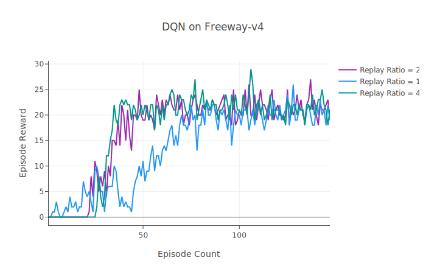

# Sample-Efficient and Safe Deep Reinforcement Learning via Reset Deep Ensemble Agents

This readme file is an outcome of the [CENG501 (Spring 2024)](https://ceng.metu.edu.tr/~skalkan/DL/) project for reproducing a paper without an implementation. <br/>
See the [CENG501 (Spring 2024) Project List](https://github.com/CENG501-Projects/CENG501-Fall2024) for a complete list of all paper reproduction projects.

# 1. Introduction

The paper subject to our implementation, published at NeurIPS 2023, introduces Reset Deep Ensemble Agents (RDE) [[1]], a framework that combines ensemble learning with periodic parameter resets to simultaneously mitigate primacy bias, and the performance collapse issues associated with parameter resetting. 
This repository aims to reproduce the paper's key findings, focusing on the proposed method's performance improvements in sample efficiency, safety, and stability.

## 1.1. Paper Summary

Deep reinforcement learning (RL) combines neural networks and reinforcement learning to solve complex tasks. However, a key challenge in deep RL is *primacy bias*, a phenomenon where deep neural networks (DNNs) overfit to early experiences, which tend to be replayed more than newer experiences, due to the design of replay buffers built into them. This bias impairs the learning process, particularly at higher replay ratios, leading to suboptimal performance and a decline in sample efficiency. Additionally, methods that mitigate primacy bias, such as *parameter resets*, can cause performance collapses immediately following resets, undermining their applicability in safe RL environments.

### Key Contributions
The paper introduces a novel approach to deep RL that:
1. Employs *sequential resets* to reduce the negative effects of primacy bias, and counter overfitting.
2. Introduces *ensemble learning* for deep RL applications which effectively combines *N* agents into a single agent, and benefits from the diversity among agents to keep the performance steadily high against sequential resets on agents within the ensemble.
3. Utilizes *adaptive action weighting* to select actions based on Q-values, ensuring robust performance and a balance between exploration and exploitation.
4. Improves *sample efficiency* compared to baseline methods across continuous and discrete environments such as Atari-100k [[2]], MiniGrid [[3]], and DeepMind Control Suite [[4]].
5. Tailors itself for *safety-critical* RL tasks through modifications in action selection, significantly reducing safety constraint violations.

# 2. The Method and Our Interpretation

## 2.1. The Original Method

The RDE framework proposes a novel methodology to tackle primacy bias and performance collapses in deep reinforcement learning. The overall diagram of the RDE is shown in Figure 1, [[1]]. First, $N$ ensemble agents with unique sets of initialized parameters are created. Ensemble agents are adaptively composited into a single agent that interacts with the environment during the training phase. At every $T_{reset}$ time-step, a single agent $k$ is selected and all of its parameters $θ_k$ are reset by a resetting mechanism.

<p align="center">
  <br>
  <em>Figure 1: Overall diagram of RDE</em>
</p>

### 1. **Ensemble Agents**
   - The system is built on an ensemble of $N$ agents, all with identical neural network architectures but initialized with distinct random parameters. This initialization promotes diversity in agent behavior and learning.
   - Each agent is independently trained using the same replay buffer, which stores past interactions with the environment. The shared replay buffer ensures sample efficiency and avoids redundancy.
   - During training, the ensemble agents are adaptively integrated into a single composite agent that interacts with the environment. This integration is key to leveraging the diversity of the ensemble while maintaining operational efficiency.

### 2. **Sequential Resets**
   - The framework introduces a staggered reset mechanism, where each agent in the ensemble undergoes a reset at fixed intervals $T_{reset}$. Resets are performed in a sequential, round-robin fashion, ensuring that at most one agent is reset at any given time.
   - During a reset, the parameters of the selected agent are reinitialized to their random initial values, while the parameters of the remaining $N-1$ agents are retained.
   - By preserving the trained parameters of most agents, the system avoids the catastrophic performance collapses associated with simultaneous resets in traditional methods. This allows the composite agent to continue interacting with the environment effectively, even during resets.

### 3. **Adaptive Action Selection**
   - To ensure robust decision-making, the composite agent selects actions adaptively based on the Q-values of each ensemble agent.
   - For a given state $s$, each agent $k$ generates an action $a_k$ along with its associated Q-value, $Q(s, a_k)$. The probability of selecting an action is determined by a softmax function:
```math
p_{s} = softmax(Q(s, a_1)/\alpha, Q(s, a_2)/\alpha, ..., Q(s, a_N)/\alpha)
```
Here, $\alpha$ is a temperature parameter that scales the Q-values to control the influence of differences among them. A higher Q-value corresponds to a higher selection probability.
   - Actions generated by recently reset agents are assigned lower probabilities because their Q-values are less reliable immediately after a reset. This adaptive weighting allows the composite agent to prioritize actions from more stable, trained agents, effectively mitigating performance instability.

### Safety-Critical Modifications
   - In safety-critical reinforcement learning tasks, such as those with constraints on unsafe states or actions, the adaptive action selection mechanism is modified to incorporate safety considerations.
   - The final selection probability is computed as:
```math
p^{safe}_{s} = \kappa * p_{s} + (1 - \kappa) * p^{c}_{s}
```
 where:
 -  $p_s$  is the action selection probability based on Q-values.
 -  $p^{c}_{s}$ prioritizes actions with lower safety costs.
 -  $\kappa$ is a mixing coefficient that balances the importance of reward maximization (through Q-values) and safety cost minimization.
 - This adjustment ensures that the composite agent not only performs efficiently but also adheres to safety constraints, reducing violations in real-world scenarios.

## 2.2. Our Interpretation

The original paper uses Stable-Baselines3 [[5]] as its primary framework, and its main mechanisms are clearly explained. However, to the best of our knowledge, Stable-Baselines3 does not support a multi-agent structure or a reset mechanism without modifications to the library itself [[7]]. Below, we outline our approach to implementing these features.

### 1. **Sequential Reset Mechanism**

The **Sequential Reset Mechanism** is a core innovation in the RDE framework that effectively mitigates primacy bias and prevents performance collapses caused by weight resetting. This approach ensures that the agents can benefit from high replay ratios without suffering from overfitting to early experiences. Below are the key details of the implementation:

1. **Configurable Reset Depth**
    - **full**: Reinitializes all layers of the neural network. 
    - **last1**: Only reinitializes the last layer of the network. 
    - **last2**: Only reinitializes the last two layers of the network. 
    - The depth of reset can be configured based on the environment and the complexity of the task. In the paper, different reset depths for various environments and tasks have been selected.

2. **Replay Buffer Preservation**
    - The replay buffer is preserved across resets, allowing agents to learn from previously collected experiences without requiring new interactions with the environment.

3. **Sequential Reset**
    - At predefined intervals, a single agent (the next one in the sequence) in the ensemble is selected for reset (parameter reinitialization), while others remain stable. The reset agent is added to the end of the reset sequence.

#### Implementation

1. Sequential selection
```python
    if (self.global_step>0) and (self.global_step % RESET_FREQUENCY == 0):
        self.reset_agent(self.last_reset_idx)
        self.oldest_agent_idx = (self.last_reset_idx + 1) % self.n_ensemble
        self.last_reset_idx   = (self.last_reset_idx + 1) % self.n_ensemble

```

2. Reset application
```python
    def reset_parameters(self, reset_depth="full"):
        """
        Re-init some or all layers:
         'full' => re-init conv + fc
         'last2' => re-init last 2 layers in self.fc
         'last1' => re-init only final linear layer
        """
        def _init_layer(m):
            if isinstance(m, (nn.Conv2d, nn.Linear)):
                nn.init.kaiming_uniform_(m.weight, nonlinearity='relu')
                if m.bias is not None:
                    nn.init.constant_(m.bias, 0.0)

        if reset_depth == "full":
            self.apply(_init_layer)

        elif reset_depth == "last2":
            if len(self.fc) == 3:  # [Linear -> ReLU -> Linear]
                _init_layer(self.fc[-1])  # final linear
                _init_layer(self.fc[-3])  # linear before ReLU
            else:
                raise ValueError("Unexpected architecture for partial reset (last2).")

        elif reset_depth == "last1":
            if len(self.fc) == 3:
                _init_layer(self.fc[-1])
            else:
                raise ValueError("Unexpected architecture for partial reset (last1).")

        else:
            raise ValueError("Unknown reset depth option.")
```

### 2. Multi-Agent Structure

The **Multi-Agent Structure (Ensemble)** is a core component of the RDE framework. The main idea is to maintain a group of agents, each with its own Q-network and optimizer while sharing a centralized replay buffer. This structure tries to achieve diversity in learning while eliminating performance collapses in case of an agent's reset by depending on other agents in the ensemble. Below are the key details of the implementation:

1. **Ensemble of Agents**
    - The implementation creates $N$ agents, each with an identical neural network architecture but independently initialized parameters.
    - Each agent interacts with the environment and contributes to the shared replay buffer.
    - Each agent has its own Q-network and target network that are independently updated using the shared replay buffer.
    - Each agent has its own optimizer, which allows independent gradient updates.

2. **Shared Replay Buffer**
    - A single centralized replay buffer is used by all agents, which stores environment transitions.
    - Sharing the replay buffer is a convenient approach, as the environment that the agents are acting upon is the same, requiring them to generate actions from the same state space representation.
    - The shared buffer ensures that all agents learn from available experiences, improving sample efficiency and reducing redundancy.

#### 2.1 Implementation

1. Ensemble of Agents
    ```python
            for _ in range(n_ensemble):
                qnet = QNetworkAtari(n_actions).to(self.device)
                tnet = QNetworkAtari(n_actions).to(self.device)
                tnet.load_state_dict(qnet.state_dict())

                optimizer = optim.Adam(qnet.parameters(), lr=LR)
                self.q_networks.append(qnet)
                self.target_networks.append(tnet)
                self.optimizers.append(optimizer)
    ```
2. Shared Replay Buffer
    ```python
    class ReplayBuffer:
        def __init__(self, capacity=100_000):
            self.buffer = deque(maxlen=capacity)

        def add(self, obs, action, reward, next_obs, done):
            self.buffer.append((obs, action, reward, next_obs, done))

        def sample(self, batch_size=32):
            batch = random.sample(self.buffer, batch_size)
            obs, acts, rews, next_obs, dones = zip(*batch)
            obs      = np.stack(obs)
            acts     = np.array(acts, dtype=np.int64)
            rews     = np.array(rews, dtype=np.float32)
            next_obs = np.stack(next_obs)
            dones    = np.array(dones, dtype=np.float32)
            return obs, acts, rews, next_obs, dones

        def __len__(self):
            return len(self.buffer)
    ```
### 3. Adaptive Action Selection

The **Adaptive Action Selection** mechanism in the RDE framework ensures robust and stable decision-making by leveraging the ensemble of agents' Q-values. This mechanism dynamically combines the actions proposed by individual agents into a single action, prioritizing stable agents and mitigating the influence of recently reset agents. Below are the key details of the implementation:

1. **Softmax-Based Weighting**
    - Actions are selected using a softmax function applied to the Q-values from the *oldest* agent. This mechanism ensures that actions with higher Q-values are assigned greater probabilities, while lower Q-values are still considered, providing a balance between exploitation and exploration.

#### 3.1 Implementation

```python

    def select_action(self, obs_np, epsilon=0.05):
        """
        Epsilon-greedy on top of the ensemble composition.
        Each agent picks argmax Q_i(s). Then a softmax weighting
        from the 'oldest' agent's Q-values on those actions.
        """
        if random.random() < epsilon:
            return random.randint(0, self.n_actions-1)

        # channels-last => channels-first => torch
        obs_ch_first = np.transpose(obs_np, (2,0,1))
        obs_t = torch.from_numpy(obs_ch_first).unsqueeze(0).float().to(self.device)

        # gather each agent's argmax
        candidate_actions = []
        with torch.no_grad():
            for qnet in self.q_networks:
                qvals = qnet(obs_t)
                act_i = qvals.argmax(dim=1).item()
                candidate_actions.append(act_i)

        # Use Q-values from 'oldest' agent
        oldest = self.oldest_agent_idx
        with torch.no_grad():
            qvals_oldest = self.q_networks[oldest](obs_t).squeeze(0)

        # for each agent's chosen action, get Q_oldest(s, a_i)
        r_values = []
        for act in candidate_actions:
            r_values.append(qvals_oldest[act].item())

        # softmax
        max_r = max(abs(r) for r in r_values) if r_values else 1.0
        if max_r == 0:
            max_r = 1.0
        scaled_r = [(val / max_r)*self.softmax_beta for val in r_values]
        exp_r = np.exp(scaled_r)
        sum_exp = np.sum(exp_r)
        if sum_exp < 1e-9:
            probs = np.ones(self.n_ensemble) / self.n_ensemble
        else:
            probs = exp_r / sum_exp

        chosen_idx = np.random.choice(self.n_ensemble, p=probs)
        return candidate_actions[chosen_idx]

```

# 3. Experiments and Results

### 3.1 Experimental Setup

### 3.1.1. Experimental Setup of the Original Paper

The original paper conducted experiments across a diverse range of tasks and environments. A summary of their setup is shown in the following parts.

### Environments
- **Atari-100k** [[2]]: Discrete action tasks with up to 100k environment steps
- **DeepMind Control Suite (DMC)** [[4]]: Continuous control tasks with high-dimensional systems
- **MiniGrid** [[3]]: Sparse reward environments with goal-oriented tasks
- **Safety-Gym** [[6]]: Environments with safety constraints

### Algorithms

- **Base Algorithm (X)**: Soft Actor-Critic or DQN. Results have only been shown for DQN in the paper.
- **Vanilla Reset Method (SR+X)**: Periodic resets preserving the replay buffer.
- **Proposed Method (RDE+X)**: Ensemble-based reset mechanism with adaptive integration.

### Hyperparameters

- **Reset Frequency**: Reset intervals are adjusted based on the environment and replay ratio.
- **Replay Ratio**: Tested with values like 1, 2, and 4 to analyze the impact of primacy bias.
- **Ensemble Size**: Typically two agents, but experiments were conducted with larger ensembles for robustness.

### 3.1.2. Experimental Setup of Our Current Implementation

We have implemented the base algorithm [DQN](src/simple_dqn.py), its alternative version with sequential resets [SR+DQN](src/dqn_vanilla_reset.py), and the method proposed in the paper [RDE](src/dqn_rde.py) in Python scripts provided in the repository. </br>

Experiments are conducted in the [Freeway-v4](https://ale.farama.org/environments/freeway/) and [MsPacmanNoFrameskip-v4](https://ale.farama.org/environments/ms_pacman/) **Atari-100k** environments provided by [ALE](https://ale.farama.org)[[2]], to investigate the effects of using **DQN**, **SR+DQN**, or **RDE** as discussed in the paper, and the value of the **replay ratio**. More environments have also been used by the paper, and are available on ALE.</br>

We justify our particular environment selections with the following reasons: **Freeway-v4** has a smaller action space (3 out of 18 standard Atari commands), and therefore can be trained relatively faster. The in-game score rewards also match the ALE rewards even when clipped within episodes, which allows the reward policy to be unaffected by ALE's reward system, and is convenient to meaningfully visualize the results. **MsPacmanNoFrameskip-v4** is a more typical Atari environment, with a larger action space (9 out of 18 standard Atari commands), therefore requires more time for training. The in-game score rewards do not correspond to ALE's own reward system, and are also susceptible to being clipped within episodes, which may have effects on the reward policy. Visualizing the results is more difficult for less timesteps or without interquartile means as done in the original paper. RDE has also been originally demonstrated to perform well in this environment. [AlienNoFrameskip-v4](https://ale.farama.org/environments/alien/) used to be our initial choice for our experiments, until we have switched over to **MsPacmanNoFrameskip-v4** for its better results.

<p align="center">
   <br>
  <em>Figure 2: Freeway and Ms Pacman from ALE.</em>
</p>

## 3.2. Running the Code

### Requirements
1. Follow instructions in the [PyTorch](https://pytorch.org/) website to set it up for your own device. 
We do not rely on environment managers such as `conda` for our setup, therefore `pip` can be used.
2. Install all other requirements with the environment manager of your preference:
    ```sh
    pip install -r requirements.txt
    ```
3. Run [DQN](src/simple_dqn.py), [SR+DQN](src/dqn_vanilla_reset.py), or [RDE](src/dqn_rde.py) by their respective files:
    ```sh
    python src/dqn_rde.py # RDE
    python src/dqn_vanilla_reset.py # SR+DQN
    python src/simple_dqn.py # DQN
    ```
4. View the experiment progress and result logs by calling a TensorBoard session in [runs](runs/):
    ```sh
    tensorboard --logdir runs
    ```
    <u>NOTE:</u> TensorBoard may not work with non-Chromium-based browsers. Try installing [Chromium](https://www.chromium.org/getting-involved/download-chromium/) if any issues persist.
5. You can also access your trained models in the [models](models/) folder after executing the scripts.

### Package Versions Used
```sh
python>=3.10.12
numpy>=1.26.4
torch==2.5.1
ale-py==0.10.1
stable_baselines3==2.4.0
# if you need to visualize the results
tensorboardX==2.6.2.2 
tensorboard==2.18.0
```

## 3.3. Results
We have used the hyperparameters given in the paper Table 3 and Table 4,[[1]].

<!-- Action results table here -->

| Method                 | Replay Ratio (RR) | Avg Reward (epsilon=0.05) | Paper Resutls |
|------------------------|-------------------|---------------------------|--------------|
| **DQN**                | 1              | 21.00                          | 15.1 |
|                        | 2              | 21.40                          | 10.9 |
|                        | 4              | 21.13                          | 14.8 |
| **DQN + SR**           | 1              | 21.60                          | 7.2 |
|                        | 2              | 6.13                           | 6.4 | 
|                        | 4              | 21.27                          | 7.9 |
| **DQN + RDE**          | 1              | 0.00                           | 4.0 |
|                        | 2              | 0.00                           | 16.8 |
|                        | 4              | 10.93                          | 21.2 |

*Table 1: Freeway-v4 Results*


| Method                 | Replay Ratio (RR) | Avg Reward (epsilon=0.05) | Paper Resutls |
|------------------------|-------------------|---------------------------|--------------|
| **DQN**                | 1              | 197.33                          | 790.0 |
|                        | 2              | 207.33                          | 907.2 |
|                        | 4              | 134.67                          | 868.4 |
| **DQN + SR**           | 1              | 170.67                          | 769.6 |
|                        | 2              | 128.67                          | 832.0 | 
|                        | 4              | 84.00                          | 954.8 |
| **DQN + RDE**          | 1              | 106.00                           | 609.6 |
|                        | 2              | 88.00                           | 831.6 |
|                        | 4              | 73.33                          | 1223.2 |

*Table 2: MsPacmanNoFrameskip-v4 Results*


<p align="center">
  <br>
  <em>Figure 3: Rewards per episode over episodes for Freeway-v4 with all models. A replay ratio of 1 is used.</em>
</p>

<p align="center">
  <br>
  <em>Figure 4: Rewards per episode over episodes for Freeway-v4 with all models. A replay ratio of 2 is used.</em>
</p>

<p align="center">
  <br>
  <em>Figure 5: Rewards per episode over episodes for Freeway-v4 with all models. A replay ratio of 4 is used.</em>
</p>

<p align="center">
  <br>
  <em>Figure 6: Rewards per episode over episodes for Freeway-v4 with DQN. Replay ratios of 1,2,4 are used.</em>
</p>

<p align="center">
  <br>
  <em>Figure 7: Rewards per episode over episodes for Freeway-v4 with SR+DQN. Replay ratios of 1,2,4 are used.</em>
</p>

<p align="center">
  <br>
  <em>Figure 8: Rewards per episode over episodes for Freeway-v4 with RDE. Replay ratios of 1,2,4 are used.</em>
</p>

<p align="center">
  <br>
  <em>Figure 9: Rewards per episode over episodes for MsPacmanNoFrameskip-v4 with all models. A replay ratio of 1 is used.</em>
</p>

<p align="center">
  <br>
  <em>Figure 10: Rewards per episode over episodes for MsPacmanNoFrameskip-v4 with all models. A replay ratio of 2 is used.</em>
</p>

<p align="center">
  <br>
  <em>Figure 11: Rewards per episode over episodes for MsPacmanNoFrameskip-v4 with all models. A replay ratio of 4 is used.</em>
</p>

<p align="center">
  <br>
  <em>Figure 12: Rewards per episode over episodes for MsPacmanNoFrameskip-v4 with DQN. Replay ratios of 1,2,4 are used.</em>
</p>

<p align="center">
  <br>
  <em>Figure 13: Rewards per episode over episodes for MsPacmanNoFrameskip-v4 with SR+DQN. Replay ratios of 1,2,4 are used.</em>
</p>

<p align="center">
  <br>
  <em>Figure 14: Rewards per episode over episodes for MsPacmanNoFrameskip-v4 with RDE. Replay ratios of 1,2,4 are used.</em>
</p>

<p align="center">
  <br>
  <em>Figure 15: Decay of exploration-to-exploitation ratio over episodes. </em>
</p>

# 4. Conclusion

From the results, it is evident that RDE offers better performance compared to SR+DQN, especially in the vicinity of sequential resets, as claimed in the paper. However, we weren't able to perform the experiments with the same amount of timesteps (1e5 compared to 1e6), due to the memory requirements of the operations. This may have led RDE to yield similar or subpar results to vanilla DQN's results. These findings are also reflected in the reward score tables of the paper as well, for some environments. The paper also employs a hyperparameter set that is constant across different environments, which could be a suboptimal approach. Considering the varying complexities of different games, either in the difficulty in reaching rewarding actions or having more complex action spaces, our implementation may have lacked in the appropriate amount of timesteps to converge to a stable solution, or the hyperparameter set provided by the paper may not have been appropriate to produce the best results. It is recommended to increase the timesteps for these experiments if possible and to optimize the hyperparameter set separately for different environments. 

For instance, visualizing the results of MsPacmanNoFrameskip-v4 showed that more convoluted games require more episodes of exploration and exploitation to better view the results, as more timesteps of actions are required to fully explore all options leading to varying levels of available rewards. Ms Pacman could, for instance, go for the power pellets and eat aliens, instead of making a few short escapes towards small pellets to score fewer points in an easier manner. Since these action sequences are rather long, exploring enough solutions to apply such experiences would take more timesteps. Consequently, the models have performed similarly, with minor performance variations among each other. Furthermore, the models have varied performance returns among different training runs, even with the same given random seeds. The original paper addresses this problem by getting the mean reward value across multiple training seeds, however the total episodes or timesteps the models are trained for must be kept adequately high as well, for the aforementioned reasons.

Another key takeaway is the manual setting of $\epsilon$ corresponding to *Figure 16*, the exploration-to-exploitation ratio. This seems to be intentionally done for the sake of experimentation in the original paper, therefore it is left in. Since the number of episodes that are considered for exploration is significantly low (no exploration is done whatsoever after 1e4 steps), the models are put to the challenge of generalizing to the replay buffer quickly and reliably. Making $\epsilon$ decrease in the direction of increasing rewards is a potential improvement to the model training procedure.

The effects of the replay ratio is evident in *Figure 7*, which allows models to converge to their optimal Q-tables faster for larger replay buffers. The mean reward value at which the models converge is however not affected by the replay ratio, but from the type of the model used instead as seen in *Figure 6*. In *Figure 8*, the performance crashes caused by sequential resets on a single DQN network can be seen. In contrast, RDE's resiliance against performance crashes during sequential resets can be seen in *Figure 9*. However, *Figure 9* also demonstrates that RDE's maximum mean reward value is lower than SR+DQN and DQN.

Another disadvantage of using RDE is the increased computational requirements. Using multiple agents in ensemble instead of a single agent especially increases the memory requirement, which limits the replay buffer depth. The action output of the ensemble is not directly taken from the Q table, but processed through a softmax layer from multiple Q tables, and there exists a need for larger replay buffers to get a performance benefit out of RDE, which are additional resource-intensive requirements that reduce its practicality in applications where it may be introduced to complex environments or limited computational resources.

RDE and SR+DQN generate more robust solutions compared to vanilla DQN in some games like Freeway, where the DQN model learns the best possible solution of *mashing up* as there is no substantial visible penalty due to car crashes. RDE and SR+DQN however make occasional attempts to *dodge cars* if the action happens to be beneficial. This may be an advantage in exploitation for some other games where obstacles or detrimental actions are more erratic. However, RDE appears to have failed in exceeding the performance of its predecessors like DQN and SR+DQN according to our test results shown in *Table 1* and *Table 2*, and requires scalability improvements for complex environments, the retuning of its hyperparameters, and the capability of being run with less memory requirements to enable its reliable use on a broader range of autonomous devices.

# 5. References

[1]: <https://arxiv.org/abs/2310.20287> "W. Kim, Y. Shin, J. Park, and Y. Sung, 'Sample-Efficient and Safe Deep Reinforcement Learning via Reset Deep Ensemble Agents,' arXiv.org, 2023. https://arxiv.org/abs/2310.20287 (accessed Nov. 23, 2024)."
[2]: <https://arxiv.org/abs/1207.4708> "M. G. Bellemare, Y. Naddaf, J. Veness, and M. Bowling, 'The Arcade Learning Environment: An Evaluation Platform for General Agents,' Journal of Artificial Intelligence Research, vol. 47, pp. 253-279, Jun. 2013, doi: https://doi.org/10.1613/jair.3912."
[3]: <https://arxiv.org/abs/2306.13831> "M. Chevalier-Boisvert et al., 'Minigrid & Miniworld: Modular & Customizable Reinforcement Learning Environments for Goal-Oriented Tasks,' arXiv.org, 2023. https://arxiv.org/abs/2306.13831 (accessed Nov. 23, 2024)."
[4]: <https://www.softwareimpacts.com/article/S2665-9638(20)30009-9/fulltext> "S. Tunyasuvunakool et al., 'dm_control: Software and tasks for continuous control,' Software Impacts, vol. 6, p. 100022, Nov. 2020, doi: https://doi.org/10.1016/j.simpa.2020.100022."
[5]: <http://jmlr.org/papers/v22/20-1364.html> "A. Raffin, A. Hill, A. Gleave, A. Kanervisto, M. Ernestus, and N. Dormann, 'Stable-Baselines3: Reliable Reinforcement Learning Implementations,' Journal of Machine Learning Research, vol. 22, no. 268, pp. 1–8, 2021, Available: http://jmlr.org/papers/v22/20-1364.html"
[6]: <https://cdn.openai.com/safexp-short.pdf> "Alex Ray, Joshua Achiam, and Dario Amodei. 2019. Benchmarking Safe Exploration in Deep Reinforcement Learning. (2019). Available: https://cdn.openai.com/safexp-short.pdf"
[7]: <https://github.com/DLR-RM/stable-baselines3/issues/622> "DLR-RM / Stable-Baselines3. Issue 662, [Feature Request] RAINBOW."

`[1]`: "W. Kim, Y. Shin, J. Park, and Y. Sung, 'Sample-Efficient and Safe Deep Reinforcement Learning via Reset Deep Ensemble Agents,' arXiv.org, 2023. https://arxiv.org/abs/2310.20287 (accessed Nov. 23, 2024)." <br/>
`[2]`: "M. G. Bellemare, Y. Naddaf, J. Veness, and M. Bowling, 'The Arcade Learning Environment: An Evaluation Platform for General Agents,' Journal of Artificial Intelligence Research, vol. 47, pp. 253-279, Jun. 2013, doi: https://doi.org/10.1613/jair.3912." <br/>
`[3]`: "M. Chevalier-Boisvert et al., 'Minigrid & Miniworld: Modular & Customizable Reinforcement Learning Environments for Goal-Oriented Tasks,' arXiv.org, 2023. https://arxiv.org/abs/2306.13831 (accessed Nov. 23, 2024)." <br/>
`[4]`: "S. Tunyasuvunakool et al., 'dm_control: Software and tasks for continuous control,' Software Impacts, vol. 6, p. 100022, Nov. 2020, doi: https://doi.org/10.1016/j.simpa.2020.100022." <br/>
`[5]`: "A. Raffin, A. Hill, A. Gleave, A. Kanervisto, M. Ernestus, and N. Dormann, 'Stable-Baselines3: Reliable Reinforcement Learning Implementations,' Journal of Machine Learning Research, vol. 22, no. 268, pp. 1–8, 2021, Available: http://jmlr.org/papers/v22/20-1364.html" <br/>
`[6]`: "Alex Ray, Joshua Achiam, and Dario Amodei. 2019. Benchmarking Safe Exploration in Deep Reinforcement Learning. (2019). Available: https://cdn.openai.com/safexp-short.pdf" <br/>
`[7]`: "DLR-RM / Stable-Baselines3. Issue 662, [Feature Request] RAINBOW. <https://github.com/DLR-RM/stable-baselines3/issues/622>"

# Contact

[Ege Uğur Aguş](mailto:ege.agus@metu.edu.tr) `mailto:ege.agus@metu.edu.tr` <br/>
[Atakan Botasun](mailto:abotasun@metu.edu.tr) `mailto:abotasun@metu.edu.tr`
